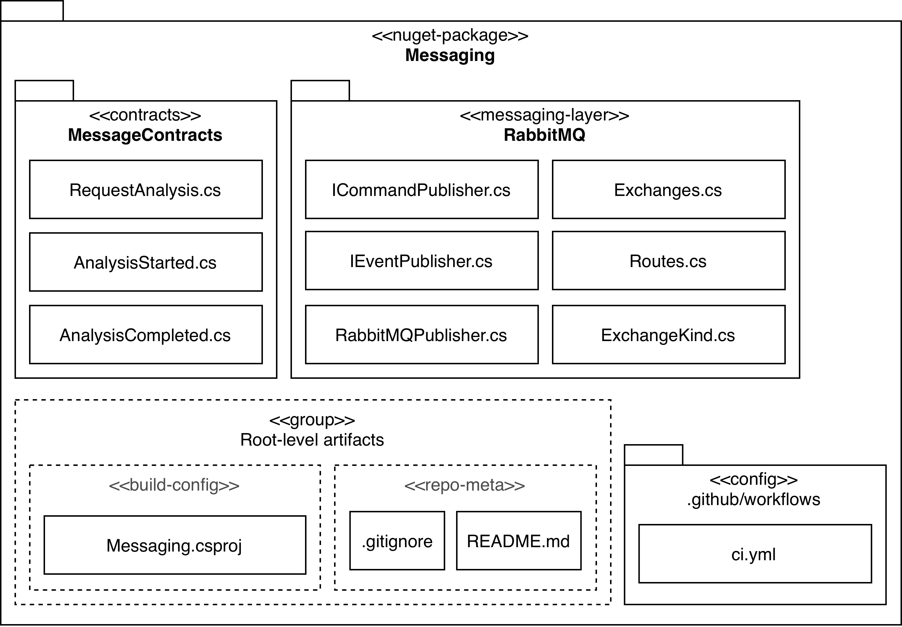
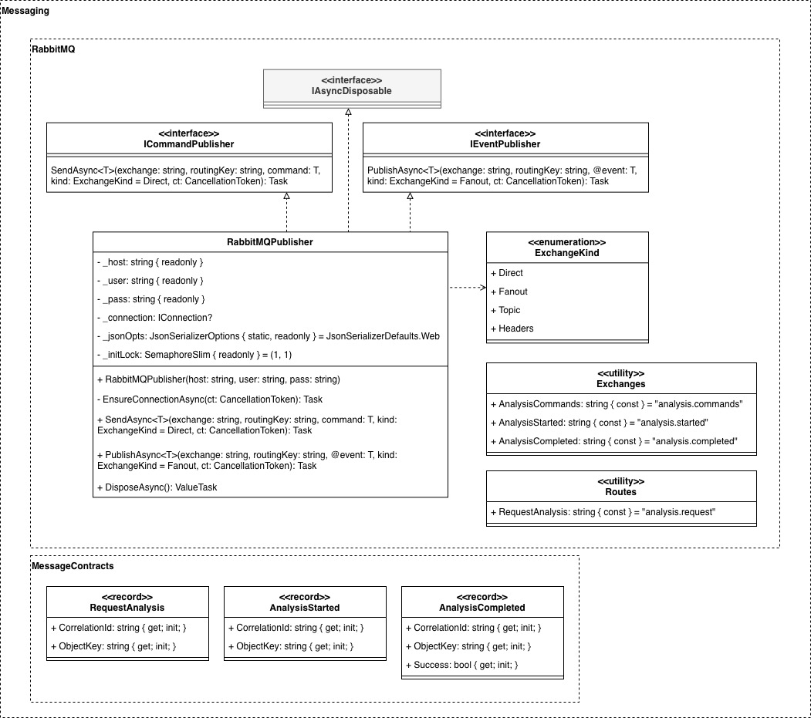

# messaging
NuGet package containing shared `MessageContracts` and reusable RabbitMQ and Kafka interfaces and implementations.

<!-- ---

## Codebase Architecture

---

## Design Class Diagram

 -->

---

See the [full system overview](https://github.com/team-2-devs/infra-core) in the **infra-core** repository.